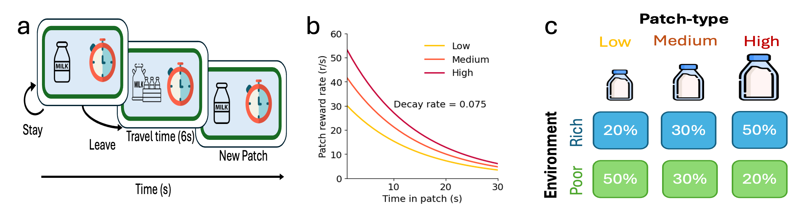
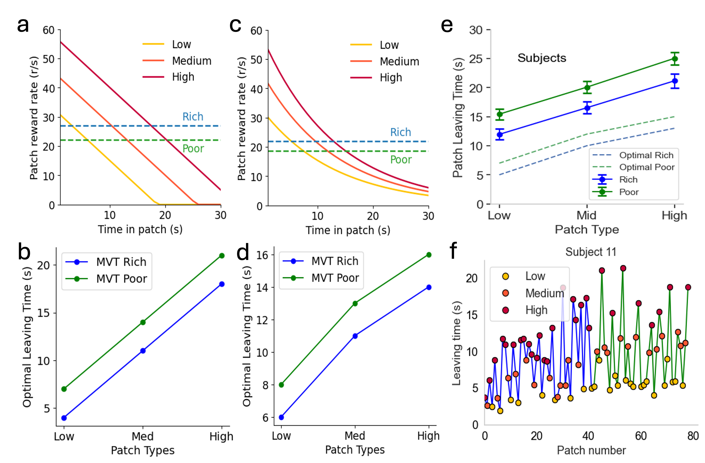
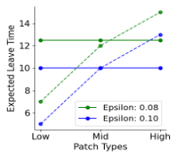
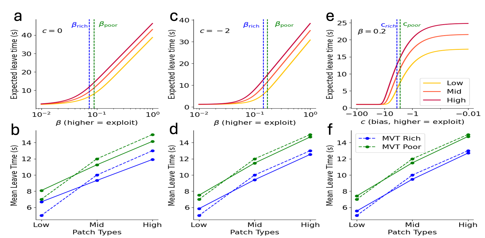
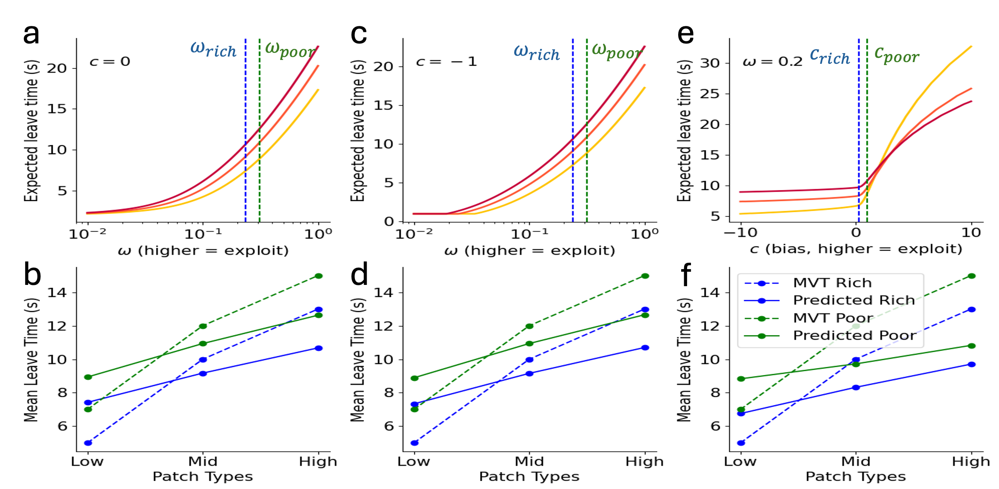
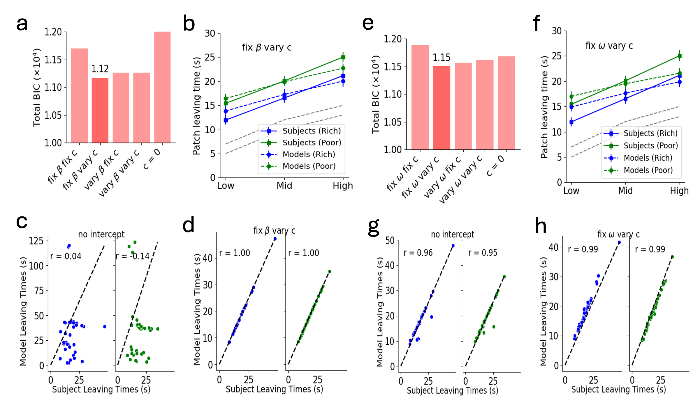
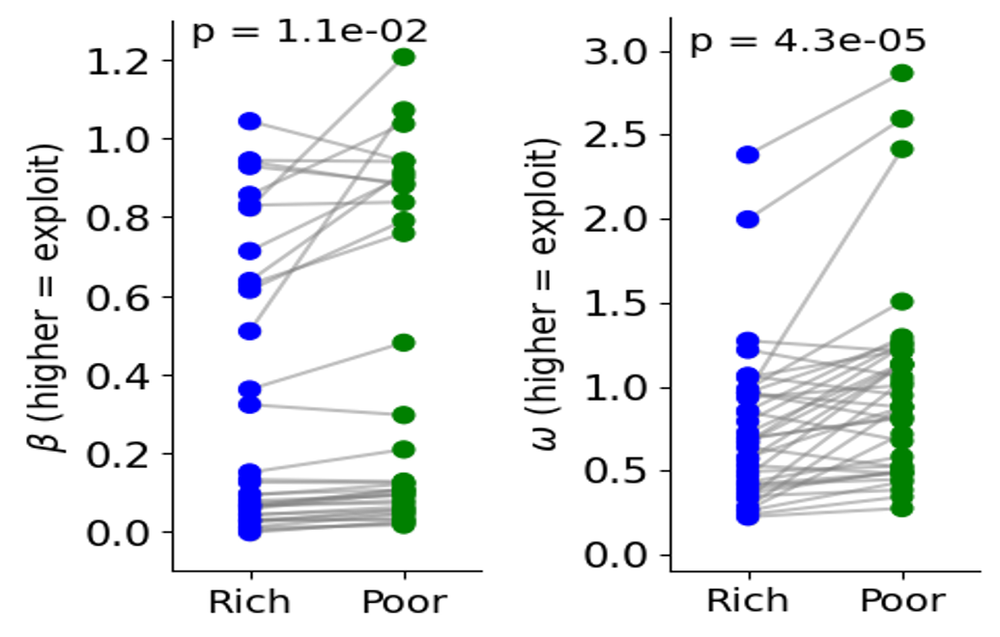
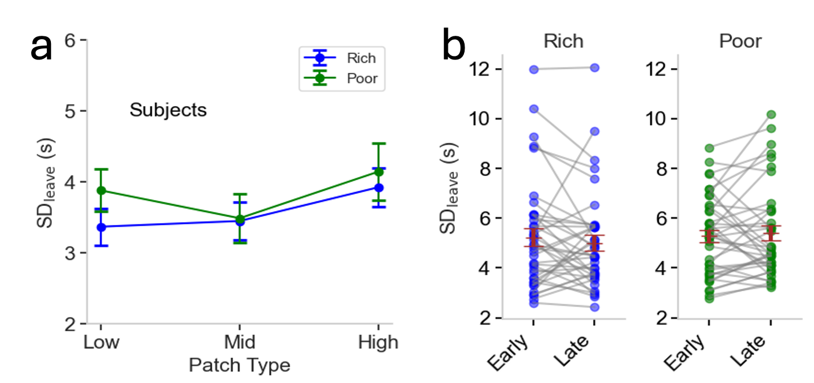
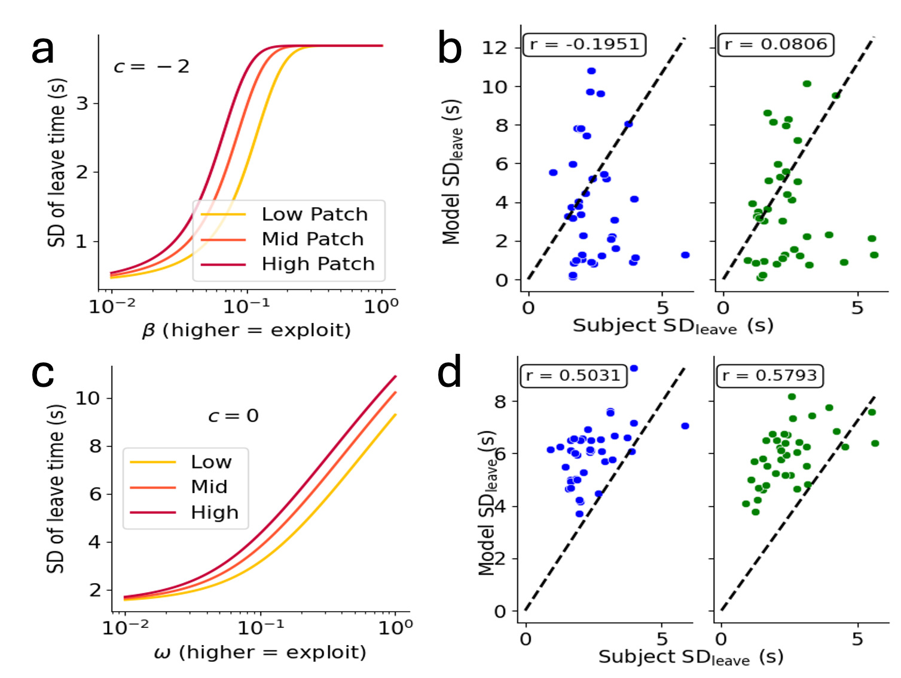
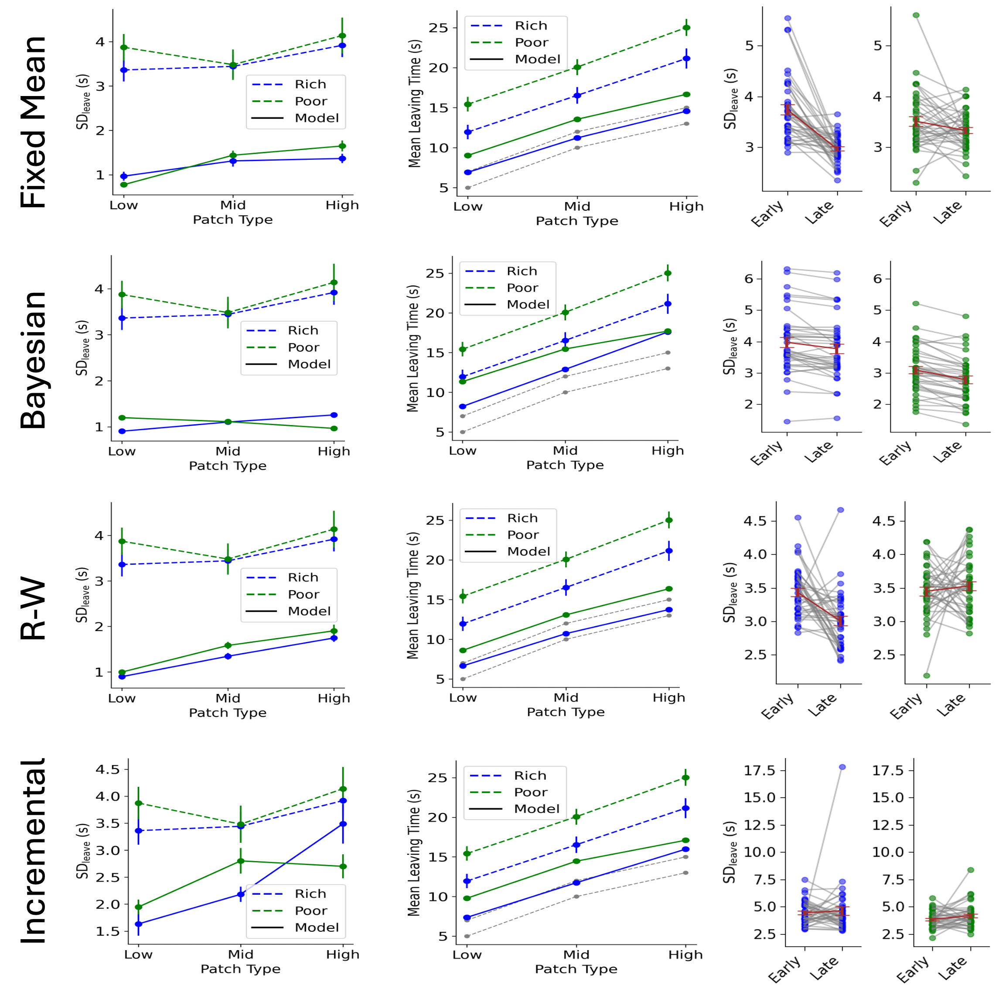

# **Stochastic Models of Exploration in Patch Foraging Tasks**

### **Abstract**
Recent advances in decision neuroscience have increasingly focused on foraging-based studies to explore the underlying mechanisms of decision-making. Building on this research, we applied a well-established patch-foraging framework to investigate human decision-making in foraging contexts. Our findings replicated earlier results, demonstrating that human foragers deviate from optimal models, such as the **Marginal Value Theorem (MVT)**.

To address the deterministic limitations of MVT, we explored stochastic action-selection algorithms, such as **epsilon-greedy**, **softmax**, and **mellowmax**. These models were assessed based on their ability to simulate foraging dynamics, incorporating key factors like the patch effect and environmental influences.

Our analysis revealed the following:

- The **softmax model** required an additional bias term to capture individual differences.
- The **mellowmax model**, with adaptive parameters, successfully modeled the diverse foraging behaviors.

Moreover, we incorporated methods to account for uncertainty in reward decay rates, providing insights into how uncertainty drives stochasticity in patch-leaving decisions.

---

### **1. Foraging Theory and Experimental Design in Decision-Making**

We implemented a **patch-foraging framework** to study human decision-making processes in various foraging tasks. The experimental design built upon Le Heron’s study, which provided key insights into patch-leaving behavior across different environments.

*Figure 1: Le Heron Patch Foraging Experimental Setup*

---

### **2. Patch-Leaving Behavior Across Patch Types**

Our analysis explored **patch-leaving behavior** under different environmental conditions. The variation in behavior was examined across different patch types, reflecting how individuals deviate from the Marginal Value Theorem.

*Figure 2: Patch-Leaving Behavior Across Patch Types and Environmental Conditions*

---

### **3. Stochastic Approaches in Patch-Leaving Decisions**

To model the observed deviations from optimal decision-making, we applied **stochastic algorithms** such as:

- **Epsilon-Greedy Algorithm**: Exploring the effect of varying epsilon values on leave times.
- **Softmax Algorithm**: Evaluating decision-making with probabilistic action selection.
- **Mellowmax Algorithm**: A smoother alternative to softmax, capturing a broader range of foraging behaviors.

*Figure 3: Mean Leave Time Across Patch Types for Different Epsilon Values*

*Figure 4: Evaluation of Softmax-Based Models*

*Figure 5: Evaluation of Mellowmax-Based Models*

---

### **4. Unveiling Individual Differences: Fitting Stochastic Models**

To account for individual differences in foraging behavior, we fitted both **softmax** and **mellowmax** models to the subject-specific data. The **mellowmax model**, with its adaptive parameters, proved to better capture variability across different environmental conditions.

*Figure 6: Comparison of Softmax and Mellowmax Parameter Fits to the Empirical Data*

*Figure 7: Parameter Fits Across Rich and Poor Environments for Softmax (β) and Mellowmax (ω) Models*

---

### **5. Analysis of Variability in Patch-Leaving Behavior**

Human decision-making in foraging contexts exhibited significant **variability in leave times**. By analyzing subject-specific data, we observed how both environmental conditions and individual preferences shaped decision strategies.

*Figure 8: Observed Variability in Leave Times Across Subjects and Environments*

*Figure 9: Model Predictions of Variability in Leave Times*

---

### **6. Exploration and Uncertainty-Driven Stochasticity**

Lastly, we introduced methods that integrate **uncertainty** into reward decay rates, providing a fresh perspective on how **uncertainty** contributes to stochastic patch-leaving decisions. This approach offers valuable insights into how humans balance exploration and exploitation in uncertain environments.

*Figure 10: Exploration and Uncertainty-Driven Stochasticity in Patch-Leaving Decisions*

---

### **Conclusion**
Our study provides compelling evidence that stochastic models, particularly the **mellowmax** approach, offer valuable improvements over deterministic models like the MVT when analyzing human foraging behavior. By incorporating both individual differences and environmental uncertainty, these models give a more nuanced view of decision-making strategies in complex, dynamic environments.

---

### **Contact Information**
For further information, questions, or collaboration inquiries, feel free to reach out over email or Linkedin.

---
